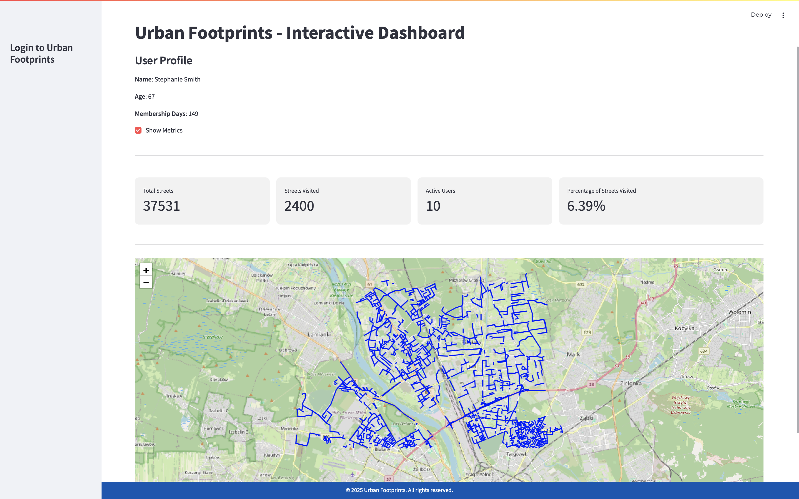

# Urban Footprints

"Urban Footprints" is a Streamlit-based web application designed to provide interactive mapping functionalities tailored for urban planning and analytics. This application allows users to log in to view specific mapped regions, presenting detailed metrics and data visualization related to urban footprints.

## Features

- **User Authentication**: Secure login and logout functionality.
- **Dynamic Mapping**: Interactive maps displaying specific urban data.
- **Metrics Display**: Real-time data metrics about the displayed maps.
- **Responsive Design**: Professionally styled interface for a better user experience.

## Installation

To get started with "Urban Footprints", follow these steps:

1. **Clone the Repository**
   \`\`\`bash
   git clone https://github.com/yourusername/urban-footprints.git
   cd urban-footprints
   \`\`\`

2. **Install Required Libraries**
   Ensure you have Python installed, and then install the required libraries using:
   \`\`\`bash
   pip install -r requirements.txt
   \`\`\`

3. **Run the Application**
   Navigate to the project directory and run the application with:
   \`\`\`bash
   streamlit run app.py
   \`\`\`

## Usage

After launching the app, you'll be greeted with a login screen. Use any of the predefined user credentials to log in and view the maps:

- **Username**: user1 to user10
- **Password**: admin (for all users)

Once logged in, you can view interactive maps and associated metrics. Use the sidebar to toggle metrics visibility or to log out.

## Project Structure

urban-footprints/  
├── data/                     
   &nbsp;&nbsp; ├── user1_map.html        
   &nbsp;&nbsp; ├── user2_map.html        
   &nbsp;&nbsp; └── ...                   
├── app.py                    
├── map_generator.py          
├── requirements.txt          
└── style.css                 

## Map Generator

`map_generator.py` is a Python script used to generate and update the HTML files for each user-specific map. Run this script whenever there is an update in the geographic data or user base.

## Contributing

Contributions to "Urban Footprints" are welcome! Please fork the repository and submit a pull request with your suggested changes.

## License

This project is licensed under the MIT License - see the LICENSE file for details.

## Contact

For any additional questions or feedback, please contact [urbanfootprints@uw.edu.pl](mailto:urbanfootprints@uw.edu.pl).

